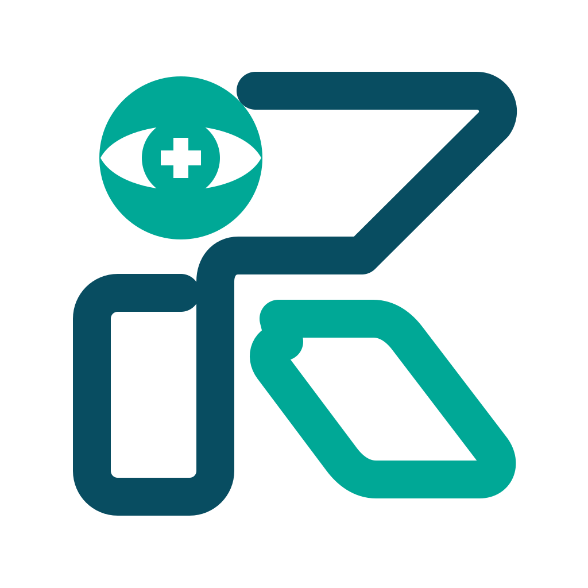

<div align="center">



# 👁️ RemiCare — Strabismus Real-Time Visual Simulator
### Mô Phỏng Trực Tiếp Thị Giác Lác & Rối Loạn Thị Giác Hai Mắt Qua Webcam Thời Gian Thực

[](https://react.dev/)
[](https://www.typescriptlang.org/)
[](https://vitejs.dev/)
[](https://tailwindcss.com/)
[](https://webrtc.org/)
[](https://www.aao.org/)
[](https://fpt.edu.vn)

*Dự án nghiên cứu & ứng dụng công nghệ mô phỏng giáo dục thị giác lâm sàng nhãn khoa hàng đầu, giúp cộng đồng thấu hiểu góc nhìn thực tế của người mắc bệnh Lác (Strabismus), Song thị (Diplopia), Ức chế vỏ não (Cortical Suppression) và Nhược thị (Amblyopia).*

---

</div>

## 📌 1. Giới thiệu Tổng quan (Overview)

Đối với người có thị giác hai mắt bình thường (Orthophoria / Binocular Single Vision), việc hình dung thế giới thị giác của một người mắc bệnh lác hoặc nhược thị là điều vô cùng khó khăn. Rất nhiều định kiến sai lầm phổ biến cho rằng *"người bị lác luôn thấy 2 hình ảnh"* hoặc *"mắt bị lác sẽ nhìn thấy bóng tối đen ngòm"*.

**RemiCare** ra đời nhằm giải quyết triệt để rào cản nhận thức đó. Bằng cách biến chính luồng video webcam thời gian thực của người dùng thành trường quan sát góc nhìn thứ nhất (First-person Perspective), RemiCare tái hiện chính xác các quy luật quang học, sự phân ly trục nhãn cầu, phản ứng thích nghi của vỏ não và cơ chế suy giảm thị lực dựa trên các nghiên cứu nhãn khoa chuẩn mực quốc tế.

---

## 🔬 2. Nền tảng Khoa học & Chuẩn Y khoa (Medical Grounding)

Hệ thống mô phỏng của **RemiCare** được xây dựng và đối chiếu nghiêm ngặt theo các tài liệu kinh điển:
- **American Academy of Ophthalmology (AAO) BCSC Series**: *Section 6 — Pediatric Ophthalmology and Strabismus*.
- **Gunter K. von Noorden & Emilio C. Campos**: *Binocular Vision and Ocular Motility (Theory and Management of Strabismus)*.
- **EyeWiki (AAO)**: Chuyên khảo về *Strabismus, Sensory Adaptations, Amblyopia & Diplopia*.

### 2.1. 3 Cấp độ Thị giác Hai mắt (Claud Worth's 3 Degrees of Binocular Vision)
1. **Cảm nhận đồng thời (Simultaneous Perception)**: Khả năng hai mắt tiếp nhận hai hình ảnh võng mạc cùng một lúc.
2. **Hợp thị cảm giác (Sensory Fusion)**: Khả năng vỏ não hợp nhất hai hình ảnh tương tự từ hai mắt thành một nhận thức đơn nhất.
3. **Thị giác lập thể (Stereopsis)**: Cấp độ cao nhất — nhận thức chiều sâu 3D tinh vi dựa trên độ chênh lệch võng mạc ngang (Horizontal Retinal Disparity).

### 2.2. Phân biệt Bản chất: Lác (Strabismus) vs. Nhược thị (Amblyopia)
- **Lác là rối loạn vận nhãn (Motor Disorder)**: Trục thị giác hai mắt không cùng hướng về một điểm định thị. Nếu lác luân phiên tự do giữa hai mắt, bệnh nhân **vẫn giữ thị lực 20/20 ở cả hai mắt** và hoàn toàn không bị nhược thị.
- **Nhược thị là suy thoái thần kinh vỏ não (Neural/Cortical Visual Deficit)**: Xảy ra khi lác chỉ cố định ở một mắt trong giai đoạn phát triển nhạy cảm (dưới 7-8 tuổi), khiến vỏ não V1 dập tắt tín hiệu mắt lệch liên tục, dẫn đến thoái hóa cấu trúc khớp nối thần kinh (Synaptic atrophy). Khi che mắt lành, mắt nhược thị bộc lộ rõ tình trạng nhìn mờ nhạt, mất chi tiết dù đã chỉnh kính tối ưu.

### 2.3. Song thị (Diplopia) & Nhầm lẫn Thị giác (Visual Confusion)
Khi lác khởi phát ở người lớn (hệ thần kinh đã trưởng thành, không còn khả năng ức chế), bệnh nhân phải đối mặt với **rối loạn cảm giác kép**:
- **Song thị (Diplopia)**: Một vật thể bị kích thích lên hoàng điểm mắt lành và vùng võng mạc ngoại vi mắt lệch, dẫn đến việc nhìn thấy **1 vật thành 2 hình** ở hai tọa độ không gian khác nhau (Song thị đồng chiều trong Lác trong, Song thị bắt chéo trong Lác ngoài).
- **Nhầm lẫn thị giác (Visual Confusion)**: Hai vật thể khác nhau rơi vào hai hoàng điểm (Fovea) cùng lúc, khiến vỏ não chiếu chồng đè hai hình ảnh khác nhau lên cùng một vị trí trung tâm.

### 2.4. Sự Thích nghi Vỏ não (Cortical Suppression) & Ám điểm Ức chế GABAergic
Ở trẻ nhỏ mắc lác, tính mềm dẻo thần kinh cho phép não bộ thích nghi bằng cách giải phóng chất dẫn truyền ức chế **GABA** tại vỏ não thị giác sơ cấp V1.
> ⚠️ **Bằng chứng y khoa khẳng định**: Não bộ **KHÔNG làm tối đen hay tắt hoàn toàn** mắt bị lệch! Não chỉ tạo ra hai ám điểm ức chế cục bộ (Foveal Scotoma triệt tiêu nhầm lẫn thị giác và Peripheral Scotoma triệt tiêu song thị). Trường nhìn ngoại vi và khả năng nhận diện chuyển động hai mắt (Motion Processing tại diện MT/V5) vẫn hoạt động đạt từ 31.2% đến 100%.

### 2.5. Hiện tượng Chen chúc trong Nhược thị (Crowding Phenomenon)
Mắt nhược thị gặp khó khăn nghiêm trọng khi phân biệt các chữ cái hoặc chi tiết đứng sát nhau trong một hàng so với chữ cái đứng đơn độc (Optotype Isolation). RemiCare tích hợp trực tiếp bảng thử nghiệm hiện tượng chen chúc trên Canvas để người dùng tự mình trải nghiệm.

---

## 🎮 3. Hai Chế độ Trải nghiệm Độc quyền (Core Modes)

### 🚀 Chế độ 1: Cốt Truyện — "Chiến Hạm Thị Giác" (Interactive Story Adventure)
Được thiết kế theo phong cách phiêu lưu khoa học viễn tưởng dành cho học sinh, phụ huynh và người trẻ tuổi, chuyển hóa các thuật ngữ nhãn khoa phức tạp thành chuyến thám hiểm vũ trụ kỳ thú gồm **6 Hồi kịch tính**:
- **Hồi 1**: *Phép màu 3D & Viên Ngọc Năng Lượng* (Thị giác hai mắt bình thường & Stereopsis).
- **Hồi 2**: *Cuộc Đào Tẩu của Mắt Lang Thang & Bướm Thiên Hà* (Lác ẩn, chớm mất bù, cơ nhãn cầu giật lại giữ 1 ảnh đơn).
- **Hồi 3**: *Đứt Dây Cương & Cảnh Báo Lệch Trục* (Lác hiện, phá vỡ dung hợp vận nhãn).
- **Hồi 4**: *Hố Đen Song Thị: Một Vật — Hai Hình Ảnh!* (Trải nghiệm nhìn đôi & nhầm lẫn thị giác).
- **Hồi 5**: *Tổng Chỉ Huy Bác Não Cứu Nguy* (Cắt cầu dao ức chế vỏ não, dập tắt ảnh phụ).
- **Hồi 6**: *Chiếc Cửa Sổ Mờ Sương: Bí Mật Nhược Thị* (Sự khác biệt khi nhìn 1 mắt và 2 mắt, hiện tượng chen chúc).
- **Hồi Kết**: *Huân Chương Chiến Hạm: Hai Mắt — Một Thế Giới* (Tuyên dương & thông điệp phát hiện sớm tật khúc xạ/lác ở trẻ).

**Đặc điểm nổi bật của Khung Truyện:**
- Khung thoại HUD tự do co giãn kích thước (Full Free-form Resize) bằng cách kéo chuột tại góc phải hoặc các cạnh.
- Chức năng thu gọn / mở rộng nhanh (Collapsible Badge) không che khuất camera.
- Hệ thống phát thanh radio lồng tiếng tự nhiên bằng Web Speech API.
- Hỗ trợ hoàn hảo trên cả Giao diện Sáng (Clinical Light Theme) và Giao diện Tối (Sci-Fi Dark Theme) với độ tương phản văn bản cao.

---

### 🔬 Chế độ 2: Phòng Khám Lâm Sàng (Clinical Lab Exploration)
Dành cho sinh viên y khoa, chuyên viên khúc xạ nhãn khoa (Optometrists) và bác sĩ lâm sàng cần khảo sát chi tiết từng biến số nhãn khoa:
1. **6 Giai đoạn Tiến triển Chuẩn (Clinical Stages)**:
   - `01. Chính thị`: Trục song song, hợp thị 100%, 3D tinh tế.
   - `02. Lác ẩn / Chớm lệch`: Giảm dự trữ dung hợp, mất bù khi mệt mỏi.
   - `03. Lác hiện rõ rệt`: Mất hợp thị cảm giác.
   - `04. Song thị & Nhầm lẫn thị giác`: Tách 2 hình độc lập theo góc lệch thực tế (~24-32px).
   - `05. Não thích nghi (Ức chế vỏ não)`: Kích hoạt ám điểm ức chế GABA V1.
   - `06. Nhược thị do Lác & Hiện tượng chen chúc`: Giảm độ nhạy tương phản, nhạt màu, mờ hình.
2. **4 Dạng Lệch Trục Nhãn Cầu (Deviation Types)**:
   - **Lác trong (Esotropia)**: Mắt lệch vào trong, gây song thị đồng chiều (Uncrossed diplopia).
   - **Lác ngoài (Exotropia)**: Mắt lệch ra ngoài, gây song thị bắt chéo (Crossed diplopia).
   - **Lác lên trên (Hypertropia)** / **Lác xuống dưới (Hypotropia)**: Lệch trục đứng.
3. **Mô phỏng Nghiệm pháp Nhãn khoa Thực tế (Orthoptic Tests)**:
   - **Cover-Uncover Test & Alternate Cover Test**: Mô phỏng động tác che mắt lành để kiểm tra mắt lệch vận động định thị lại (Refixation movement).
   - **Nghiệm pháp Worth 4-Dot (4 điểm Worth)**: Giả lập kiểm tra hợp thị bằng kính đỏ-xanh (Thấy 4 chấm = Hợp thị bình thường; Thấy 2 hoặc 3 chấm = Ức chế 1 mắt; Thấy 5 chấm = Song thị).
   - **Nghiệm pháp Hirschberg (Corneal Light Reflex)**: Chiếu điểm phản xạ ánh sáng trên giác mạc (Trung tâm = 0 độ; Rìa đồng tử ~15 độ / 30Δ; Giữa mống mắt ~30 độ / 60Δ; Rìa củng giác mạc ~45 độ / 90Δ).
   - **Bảng kiểm tra Hiện tượng Chen chúc (Crowding Test)**: So sánh độ sắc nét chữ cái đứng đơn lẻ với chữ cái trong chuỗi dài.

---

## 💻 4. Kiến trúc Kỹ thuật & Công nghệ (Engineering Architecture)

```
┌────────────────────────────────────────────────────────┐
│                   Browser Environment                  │
│                                                        │
│  [navigator.mediaDevices.getUserMedia]                 │
│         │ (WebRTC Camera Stream)                       │
│         ▼                                              │
│  [HTMLVideoElement] (Hidden, autoPlay, playsInline)    │
│         │                                              │
│         ▼                                              │
│  ┌──────────────────────────────────────────────────┐  │
│  │ Render Loop (requestAnimationFrame @ 60 FPS)      │  │
│  │                                                  │  │
│  │  1. Ingest frame & Aspect Ratio Cover calculation│  │
│  │  2. Read Simulation Parameters from Unmanaged Ref│  │
│  │  3. Real-time Face & Distance Estimation (cm)    │  │
│  │  4. Split into Left & Right Visual Channels      │  │
│  │  5. Apply Retinal Disparity, Prism & Blur        │  │
│  │  6. Apply GABAergic Scotoma / Visual Confusion   │  │
│  │  7. Orthoptic Test Compositing (Cover / Hirschberg)│
│  │  8. High-DPI Output to Presentation Canvas       │  │
│  └──────────────────────────────────────────────────┘  │
│         │                                              │
│         ▼                                              │
│  [HTMLCanvasElement (GPU Accelerated)]                 │
│                                                        │
│  ┌──────────────────────────────────────────────────┐  │
│  │ React 19 UI Layer (Decoupled from Render Loop)   │  │
│  │  - Story Dialogue HUD & Resizable Panel          │  │
│  │  - Clinical Sidebar & Medical Reference Modal    │  │
│  │  - Multi-language (VI / EN / KM)                 │  │
│  │  - Theme Switcher (Dark Sci-Fi / Light Clinical) │  │
│  │  - Natural Web Speech Audio Voiceover Service    │  │
│  └──────────────────────────────────────────────────┘  │
└────────────────────────────────────────────────────────┘
```

### Điểm nhấn Kỹ thuật Hàng đầu:
- **Tách biệt Triệt để Render Loop khỏi React State**: Vòng lặp `requestAnimationFrame` đọc thông số trực tiếp từ unmanaged JavaScript ref, đảm bảo đạt tốc độ mượt mà **60 FPS** liên tục mà không gây re-render thừa cho cây DOM React.
- **Canvas 2D Tối ưu hóa Cao**: Sử dụng canvas 2D kết hợp biến đổi ma trận toạ độ, `globalAlpha` và bộ lọc quang học, khởi động tức thì 0ms, không gặp lỗi mất ngữ cảnh (Context Loss) như WebGL trên thiết bị di động.
- **Bộ Ước lượng Khoảng cách Khuôn mặt Nhẹ (`faceTracker.ts`)**: Tự động đo khoảng cách người dùng đến camera (12cm - 48cm) theo tỉ lệ khung hình khuôn mặt thực tế mà không cần nạp các mô hình AI cồng kềnh lên tới 20MB.
- **Cơ chế Fallback Linh hoạt**: Tự động chuyển đổi sang cảnh quang học nhân tạo tương tác cao nếu thiết bị không có webcam hoặc người dùng từ chối cấp quyền camera.
- **Theme Kép Toàn diện**: Hỗ trợ Dark Mode (Chiến Hạm Không Gian) và Light Mode (Phòng Khám Hiện Đại) với khả năng ghi nhớ `localStorage` và lắng nghe tự động bằng `MutationObserver`.

---

## 📁 5. Cấu trúc Dự án (Project Structure)

```text
strabismus-visual-simulator/
├── public/                     # Static assets & Brand Logos
│   ├── favicon.svg             # Favicon vector
│   ├── remicare-logo.png       # Logo chính thức RemiCare
│   └── remicare-logo-transparent.png # Logo trong suốt
├── src/
│   ├── components/             # Các thành phần giao diện React
│   │   ├── ExperienceView.tsx  # Màn hình chính điều phối Camera & Render Loop
│   │   ├── MedicalModal.tsx    # Modal tra cứu tài liệu Y khoa & trích dẫn AAO
│   │   ├── RemiCareLogo.tsx    # Component hiển thị Logo thương hiệu
│   │   ├── RightSidebar.tsx    # Bảng điều khiển Khảo sát Lâm sàng chuyên sâu
│   │   ├── StereopsisExplainer.tsx # Bảng giải thích cơ chế Thị giác Lập thể 3D
│   │   ├── StoryDialogueBox.tsx# Khung truyện HUD co giãn tự do & lồng tiếng
│   │   ├── StoryIntroModal.tsx # Modal giới thiệu Chuyến du hành Chiến Hạm
│   │   ├── StoryMascot.tsx     # Linh vật tương tác Bác Não & Phi công Mắt
│   │   ├── StorySidebar.tsx    # Bảng theo dõi tiến trình 7 Hồi Nhật Ký
│   │   └── StoryVisualProps.tsx# Đạo cụ thị giác tương tác nổi trên màn hình
│   ├── engine/                 # Lõi tính toán & xử lý quang học
│   │   ├── simulationEngine.ts # Engine biến đổi hình ảnh 2 kênh võng mạc (60 FPS)
│   │   └── faceTracker.ts      # Bộ nhận diện khuôn mặt & ước lượng khoảng cách
│   ├── services/
│   │   └── medicalAudioService.ts # Dịch vụ đọc lời thoại & lồng tiếng Y khoa TTS
│   ├── types/
│   │   ├── simulation.ts       # Định nghĩa thông số lâm sàng, giai đoạn & AAO Registry
│   │   └── story.ts            # Dữ liệu kịch bản 6 Hồi Chiến Hạm Thị Giác
│   ├── App.tsx                 # Root Application Component
│   ├── index.css               # Hệ thống Tailwind CSS & Quy tắc Light/Dark Theme
│   └── main.tsx                # Application Entry Point
├── package.json                # Dependencies & Scripts
├── tsconfig.json               # TypeScript Compiler Config
└── vite.config.ts              # Vite Bundler Config
```

---

## 🚀 6. Hướng dẫn Cài đặt & Khởi chạy (Getting Started)

### Yêu cầu Tiên quyết (Prerequisites)
- **Node.js** phiên bản `>= 18.0.0` hoặc **Bun** `>= 1.0.0`.
- Trình duyệt hiện đại hỗ trợ WebRTC và Canvas (Chrome, Edge, Firefox, Safari).
- Webcam máy tính hoạt động bình thường.

### Các bước Cài đặt
1. **Clone mã nguồn dự án**:
   ```bash
   git clone https://github.com/hoanghan-dev/strabismus-visual-simulator.git
   cd strabismus-visual-simulator
   ```

2. **Cài đặt các gói phụ thuộc (Dependencies)**:
   ```bash
   npm install
   # Hoặc sử dụng Bun:
   bun install
   ```

3. **Khởi chạy Development Server**:
   ```bash
   npm run dev
   ```
   Ứng dụng sẽ chạy tại địa chỉ: `http://localhost:3000` (hoặc cổng được hiển thị trong terminal).

4. **Kiểm tra cú pháp & Typecheck (Lint)**:
   ```bash
   npm run lint
   ```

5. **Đóng gói ứng dụng cho Production**:
   ```bash
   npm run build
   npm run preview
   ```

---

## ⚠️ 7. Tuyên bố Miễn trừ Trách nhiệm Y tế (Medical Disclaimer)

> **LƯU Ý QUAN TRỌNG:**
> 1. **RemiCare là ứng dụng giáo dục và mô phỏng nhận thức trực quan**, hoàn toàn **KHÔNG PHẢI** là công cụ chẩn đoán, điều trị, đo lường độ lác (Strabismus Measurement) hay thay thế cho bất kỳ quy trình thăm khám nhãn khoa lâm sàng nào.
> 2. Các thông số lác, song thị và ức chế được chuẩn hoá nhằm mục đích giáo dục thị giác trực quan. Nếu bạn hoặc người thân có dấu hiệu nhìn đôi, mỏi mắt bất thường, lé/lác hoặc suy giảm thị lực, hãy đến ngay các bệnh viện mắt hoặc cơ sở y tế chuyên khoa mắt để được bác sĩ thăm khám toàn diện.

---

## 📚 8. Tài liệu Tham khảo (Academic References)

1. **American Academy of Ophthalmology (AAO)**. *Pediatric Ophthalmology and Strabismus*, Basic and Clinical Science Course (BCSC), Section 6, 2023–2024.
2. **von Noorden, G. K., & Campos, E. C.** (2002). *Binocular Vision and Ocular Motility: Theory and Management of Strabismus* (6th ed.). Mosby.
3. **Pratt-Johnson, J. A., & Tillson, G.** (2001). *Management of Strabismus and Amblyopia: A Practical Guide*. Thieme.
4. **EyeWiki — American Academy of Ophthalmology**:
   - *Adult Strabismus & Diplopia Evaluation*.
   - *Suppression Scotoma and Cortical Adaptations*.
   - *Amblyopia: Mechanisms and Crowding Phenomenon*.
5. **Levi, D. M.** (2008). *Crowding—An essential bottleneck for object recognition: A mini-review*. Vision Research, 48(5), 635–654.

---

## 👥 9. Thông tin Đề tài & Tác giả (Project Info)

- **Đơn vị đào tạo**: Đại học FPT (FPT University)
- **Học kỳ / Môn học**: FA26 / EXE101 (Experiential Entrepreneurship & Research)
- **Dự án**: RemiCare — Ophthalmology & Binocular Vision Simulator
- **Bản quyền**: © 2026 RemiCare Team. Phát triển vì mục đích giáo dục cộng đồng.
